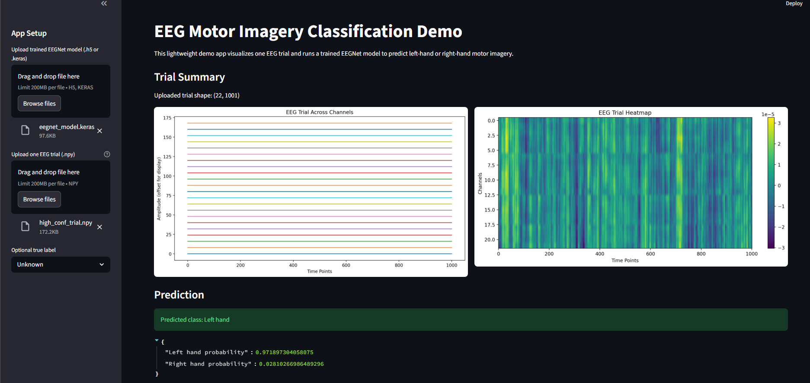

# Comparative Analysis of SVM, CNN, and EEGNet for EEG Motor Imagery Classification

This project presents a comprehensive comparative study of machine learning and deep learning approaches for classifying motor imagery EEG signals. The primary objective is to decode brain activity associated with imagined left-hand and right-hand movements and evaluate how different models perform on raw and minimally processed EEG data.

---

## 🚀 Project Overview

Electroencephalography (EEG) signals are widely used in Brain-Computer Interface (BCI) systems to interpret human intentions directly from neural activity. However, EEG data is inherently noisy, high-dimensional, and highly variable across trials and subjects.

In this project, I explore and compare three different modeling approaches:

- **Support Vector Machine (SVM)** — a classical machine learning baseline  
- **1D Convolutional Neural Network (CNN)** — a deep learning model for temporal feature extraction  
- **EEGNet** — a lightweight, domain-specific architecture designed for EEG signals  

The project covers the **entire pipeline**, from signal preprocessing to model deployment via an interactive web application.

---

## 🧠 Dataset

- **Dataset:** BCI Competition IV Dataset 2a  
- **Channels:** 22 EEG + 3 EOG  
- **Sampling Rate:** 250 Hz  
- **Subjects:** 9  
- **Classes:**  
  - Left hand  
  - Right hand  
  - Feet  
  - Tongue  

### 🔍 Focus of this Project

To simplify the classification problem and improve interpretability:

- Only **left-hand vs right-hand motor imagery** is used  
- The task is treated as a **binary classification problem**

---

## ⚙️ Methodology

The pipeline consists of the following key stages:

### 1. Data Loading
- EEG data loaded using the **MNE library**
- GDF files parsed into structured Raw objects

### 2. Signal Preprocessing
- Bandpass filtering applied (focus on motor imagery frequency bands)
- Removal of noise and irrelevant frequency components

### 3. Event Extraction
- Event markers extracted from annotations
- Mapping of event IDs to motor imagery classes

### 4. Epoching
- Continuous EEG signals segmented into trials (epochs)
- Time window selection to isolate relevant signal regions

### 5. Channel Selection
- Only EEG channels retained  
- EOG channels removed to avoid eye-movement artifacts

### 6. Normalization
- Per-trial normalization applied:
  - Zero mean
  - Unit variance  
- Helps stabilize model training

### 7. Feature Representation
- SVM: Flattened feature vectors  
- CNN/EEGNet: Structured time-series input  

### 8. Model Training & Evaluation
- Train-test split applied  
- Models evaluated using accuracy, precision, and recall  

---

## 🤖 Models

### 🔹 1. Support Vector Machine (SVM)
- Baseline classical model  
- Operates on flattened EEG signals  
- Does not capture temporal or spatial relationships  

---

### 🔹 2. 1D Convolutional Neural Network (CNN)
- Learns temporal features across time  
- Captures local signal patterns  
- Limited ability to model spatial relationships between channels  

---

### 🔹 3. EEGNet (Proposed Model)
- Specifically designed for EEG-based classification  
- Combines:
  - Temporal convolutions  
  - Depthwise separable convolutions  
- Efficient in learning:
  - Spatial relationships between channels  
  - Frequency-specific patterns  

---

## 📊 Results

| Model   | Accuracy |
|--------|--------|
| SVM    | ~51%   |
| CNN    | ~51%   |
| EEGNet | **~83%** ✅ |

---

## 🧠 Key Insights

- Traditional models like SVM struggle with raw EEG due to lack of temporal and spatial modeling  
- Standard CNN improves performance but remains limited in capturing channel relationships  
- EEGNet significantly outperforms both, demonstrating:
  - Better feature extraction  
  - Stronger generalization  
  - Suitability for EEG-based tasks  

👉 This highlights the importance of **domain-specific architectures in neurotechnology**

---

## 🖥️ Streamlit Demo App

This project includes a lightweight interactive web application that enables real-time inference.

### ✨ Features

- Upload a trained EEGNet model (.keras or .h5)  
- Upload an EEG trial (.npy format)  
- Visualize EEG signals  
- Predict motor imagery class  

---

## 🖼️ Demo Preview



---

### ✨ Features

- Upload a trained EEGNet model (.keras or .h5)  
- Upload an EEG trial (.npy format)  
- Visualize EEG signals:
  - Multi-channel time-series plot  
  - Heatmap representation  
- Perform real-time classification  
- Display prediction probabilities and confidence  

---

### ▶️ Run the App

```bash
pip install streamlit tensorflow matplotlib numpy
streamlit run eeg_motor_imagery_demo_app.py
```

## 🧠 Conclusion

This project presented a comparative analysis of three models for EEG motor imagery classification: SVM, 1D CNN, and EEGNet. The results showed that both the SVM and the standard 1D CNN performed close to chance level, indicating that generic machine learning and deep learning approaches struggle to capture meaningful patterns from small and noisy EEG datasets.

The 1D CNN also showed signs of overfitting, where training accuracy increased while validation accuracy remained low.

In contrast, EEGNet achieved the best performance, with a test accuracy of approximately 82.76%. This demonstrates that domain-specific architectures are far more effective for EEG signal classification.

Overall, this project highlights the importance of proper EEG preprocessing, careful model design, and specialized architectures in Brain-Computer Interface applications.
